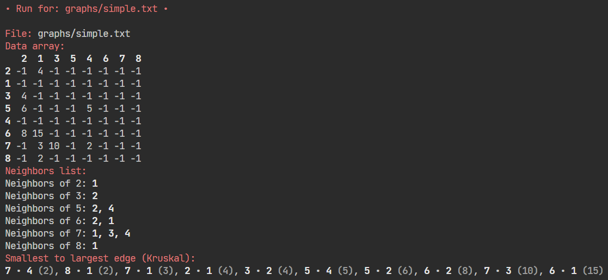
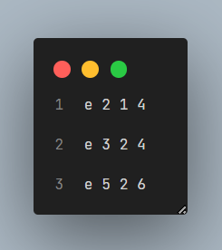

# Graphs

This Python project provides a collection of algorithms for undirected graphs. It includes implementations of well-known algorithms such as Kruskal's.

Preview:


Input file (graphs) exemple:


## Installation


    ```bash
git clone https://github.com/agatocherry/graphs.git
```

## Usage

```bash
./graphs.sh
```
